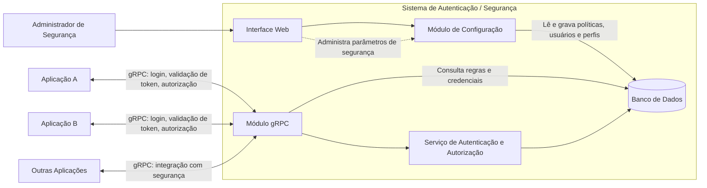

# Sistema de Autenticação e Segurança

## Visão Geral
Este sistema centraliza os processos de **autenticação** e **autorização** para múltiplas aplicações. A administração é feita por uma **interface web**, enquanto um **módulo gRPC** disponibiliza os serviços de segurança para sistemas externos.

## Objetivos
- Centralizar a gestão de usuários, perfis e políticas de acesso.
- Permitir integração padronizada com outras aplicações via `gRPC`.
- Garantir consistência nas regras de segurança em todo o ecossistema.

## Arquitetura

## Componentes Principais
### 1. Interface Web
- Painel administrativo para configuração do sistema.
- Cadastro e manutenção de usuários, perfis e permissões.
- Ajuste das políticas de segurança salvas no banco de dados.

### 2. Banco de Dados
- Armazena usuários, credenciais, perfis e políticas.
- Serve como fonte central das configurações de segurança.

### 3. Serviço de Autenticação e Autorização
- Valida credenciais de acesso.
- Aplica regras de autorização.
- Pode emitir e validar tokens de autenticação.

### 4. Módulo gRPC
- Expõe os serviços de segurança para aplicações externas.
- Permite integração com funcionalidades como:
  - login;
  - validação de token;
  - autorização de operações;
  - consulta de perfis e permissões.

## Fluxo de Funcionamento
1. O administrador acessa a **Interface Web**.
2. As configurações de segurança são gravadas no **Banco de Dados**.
3. O **Serviço de Autenticação e Autorização** utiliza essas informações para validar acessos.
4. As aplicações externas se conectam ao **Módulo gRPC**.
5. O sistema responde com base nas políticas centralizadas.

## Benefícios
- Segurança centralizada.
- Reuso da autenticação por múltiplas aplicações.
- Integração escalável e padronizada via `gRPC`.
- Redução de duplicidade nas regras de acesso.

## Casos de Uso
- Login unificado entre sistemas.
- Validação central de permissões.
- Integração de aplicações corporativas com um serviço único de segurança.

## Estrutura dos Arquivos
- `Seguranca.mmd`: diagrama Mermaid da arquitetura.
- `Seg.md`: documentação geral do sistema.

## Próximos Passos
- Definir os contratos `.proto` do `gRPC`.
- Especificar o modelo de dados do banco.
- Documentar os fluxos de login, autorização e auditoria.
